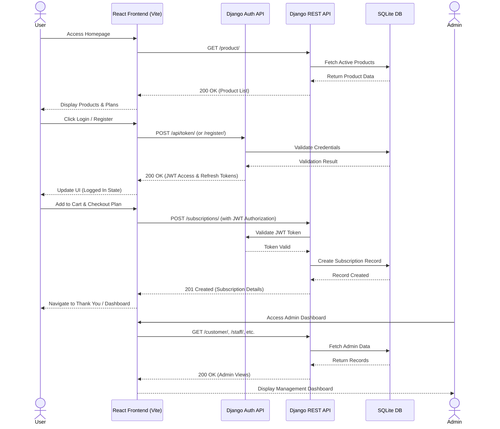

# Project Setup

This project has:
- Backend: Django REST API in `milkman/` (port 8000)
- Frontend: React + Vite app in `backened/` (port 5173)

## Prerequisites

- Node.js 18+ and npm
- Python 3.10+

## Backend (Django) Setup

1) Create and activate a virtual environment (Windows PowerShell):

```
cd d:\Learning\Trae\testDay2\milkman
py -3 -m venv .venv
.venv\Scripts\activate
```

2) Install dependencies:

```
pip install "Django>=6,<7" djangorestframework django-cors-headers
```

3) Run migrations and start the server:

```
python manage.py migrate
python manage.py runserver
```

Backend runs at http://localhost:8000/

## Frontend (React + Vite) Setup

1) Install dependencies:

```
cd d:\Learning\Trae\testDay2\backened
npm install
```

2) Start the dev server:

```
npm run dev
```

Frontend runs at http://localhost:5173/

## API Endpoints

- Categories: `/category/`
- Products: `/product/`
- Customers: `/customer/`
- Subscriptions: `/subscriptions/`

Import the included Postman collection for quick testing:
`milkman-apis.postman_collection.json` in the project root.

## Notes

- CORS is enabled in the backend (`django-cors-headers`) for local development.
- Ensure backend is running before using the frontend or Postman requests.

## System Sequence Diagram

Here is a high-level sequence diagram of the E-Milk Shop application flow:


